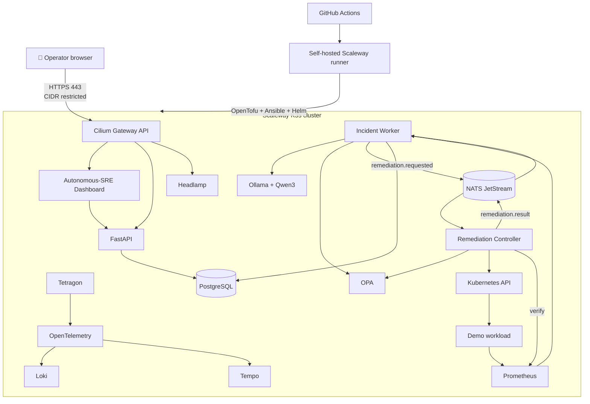
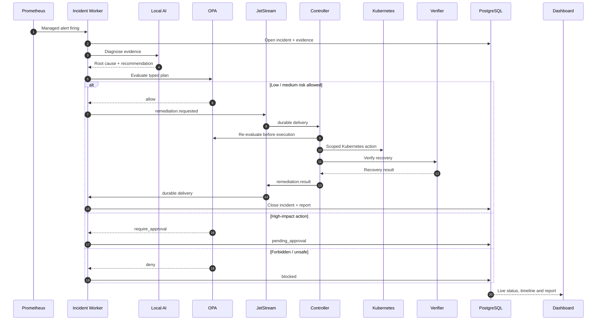
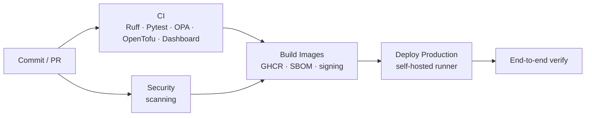

<div align="center">

# 🤖 Autonomous-SRE

### Policy-controlled autonomous incident response for Kubernetes

Detect. Reason. Decide. Remediate. Verify. Report.

[](https://github.com/CheikhAiLabs/Autonomous-SRE/actions/workflows/ci.yml)
[](https://github.com/CheikhAiLabs/Autonomous-SRE/actions/workflows/security.yml)
[](https://www.python.org/)
[](https://k3s.io/)
[](https://opentofu.org/)
[](https://www.openpolicyagent.org/)
[](LICENSE)

Private, self-hosted and open-source by design. No proprietary LLM API is required in the runtime path.

</div>

---

## ✨ What this project is

Autonomous-SRE is a production-oriented autonomous SRE platform running on Kubernetes on Scaleway Compute. It continuously watches managed Prometheus alerts, builds incident evidence, asks a local Ollama/Qwen model for a structured diagnosis, generates a remediation plan from a constrained action catalog, sends that plan through OPA policy, executes permitted Kubernetes changes, verifies recovery and produces an auditable incident report.

The platform is intentionally designed around safe autonomy rather than unrestricted automation. The model never receives a general-purpose shell. It can recommend only actions that exist in the remediation catalog, and every action still has to pass schema validation, policy, Kubernetes RBAC and post-remediation verification.

### At a glance

| Capability | Current behavior |
|---|---|
| 🔭 Detection | Prometheus alerts explicitly labelled `sre_managed=true` |
| 🧠 Reasoning | Local Ollama + Qwen3 with deterministic fallback behavior |
| 🧭 Planning | Typed remediation plans backed by a static action catalog |
| 🛡️ Policy | OPA decides `allow`, `require_approval` or `deny` |
| ⚡ Autonomous actions | Guardrailed low and medium-risk remediations |
| 👤 Human approval | Required for selected high-impact actions |
| 🚫 Forbidden actions | Destructive operations remain blocked |
| 📬 Event transport | File-backed NATS JetStream durable work queues |
| ✅ Recovery | Kubernetes-state or Prometheus-threshold verification |
| 📧 Reporting | Per-incident timeline, JSON report and SMTP delivery tracking |
| 🖥️ Operations UI | React command center plus Headlamp Kubernetes Explorer |
| 🔐 Access | Operator/runner CIDR-restricted Scaleway Security Group |
| 🧪 Validation | Unit/policy tests plus real Kubernetes chaos scenarios |

---

## 🏗️ Architecture



The infrastructure layer is created with OpenTofu, operating-system and K3s configuration are handled by Ansible, platform components are reconciled with Helm/Helmfile, and application manifests are rendered and applied by the deployment pipeline.

---

## 🔄 Autonomous incident lifecycle



### Why the controller checks policy twice

The worker evaluates OPA before dispatching anything. The remediation controller then evaluates the plan again immediately before execution. An approved high-impact request also carries a signed, short-lived approval proof that the controller verifies independently.

This keeps the execution boundary separate from the AI/reasoning boundary.

---

## 🧩 Agent model

The Command Center exposes the operational state of each stage instead of hiding the workflow behind one generic status.

| Agent | Responsibility | Typical states |
|---|---|---|
| Detector | Poll managed Prometheus alerts and create incidents | `watching`, `success`, `error` |
| AI Reasoner | Build the likely root cause from incident evidence | `working`, `success`, `error` |
| Planner | Convert diagnosis into a typed catalog action | `working`, `success`, `blocked` |
| Policy Guard | Ask OPA whether the plan is safe | `working`, `success`, `blocked` |
| Remediator | Execute the permitted Kubernetes change | `watching`, `working`, `success`, `error` |
| Recovery Verifier | Confirm the platform really recovered | `idle`, `working`, `success`, `error` |
| Case Manager | Track lifecycle, dispatch and closure | `working`, `waiting`, `success`, `error` |
| Notification | Track email delivery per incident | `success`, `skipped`, `error` |

The remediation controller and recovery verifier emit fresh heartbeats every 15 seconds. The worker refuses to dispatch an autonomous remediation when the controller heartbeat is stale.

A stale `remediating` incident is also closed as failed when the same managed condition is still firing beyond the recovery timeout, allowing a new clean incident to be created instead of leaving the workflow permanently stuck.

---

## 🛡️ Safety model

Autonomy is governed by both the action catalog and OPA.

### Default remediation posture

| Risk | Examples | Default behavior |
|---|---|---|
| `low` | Deployment restart, rollback, small Deployment scale, single Pod replacement | Automatic |
| `medium` | Extended scale, StatefulSet restart/scale, DaemonSet restart, node uncordon | Automatic within guardrails |
| `high` | Node cordon | Explicit operator approval |
| `forbidden` | Node drain, namespace deletion, infrastructure destruction | Always denied |

Protected namespaces such as `kube-system`, `sre-system`, `monitoring`, `argocd` and `chaos-mesh` cannot be targeted by autonomous remediation.

### Defense in depth

```text
LLM recommendation
      ↓
Pydantic schema validation
      ↓
Static remediation catalog
      ↓
OPA policy decision
      ↓
Controller-side policy re-check
      ↓
Dedicated Kubernetes RBAC
      ↓
Scoped Kubernetes API action
      ↓
Post-remediation verification
      ↓
Audited result + report
```

There is deliberately no arbitrary Bash executor in the autonomous path.

---

## 📬 Durable remediation delivery

Remediation requests and remediation results use a dedicated JetStream stream named `AUTONOMOUS_SRE`.

```text
Worker
  └── remediation.requested ──► JetStream ──► Remediation Controller

Controller
  └── remediation.result ─────► JetStream ──► Incident Result Handler
```

The stream uses file storage and work-queue retention. Consumers are durable, explicitly acknowledge successful handling and negatively acknowledge failed handling for redelivery. The acknowledgement window is intentionally longer than the normal recovery-verification window so a valid remediation is not redelivered merely because verification takes time.

Delivery semantics are at-least-once, not exactly-once. The supported remediation actions are therefore intentionally narrow and mostly idempotent/scoped. JetStream persistence protects messages across SRE service restarts; the default NATS deployment is not presented as a multi-region message bus.

---

## 🖥️ Command Center

The React dashboard is the operational front door for the platform. It refreshes every two seconds and shows:

- active incidents and recovered interventions,
- live agent states and heartbeat-driven health,
- the event delivery mode,
- the full agent activity journal,
- diagnosis confidence and evidence,
- remediation action, target, risk and policy decision,
- approval controls for high-impact actions,
- complete per-incident timelines,
- JSON incident reports,
- actual email delivery status for each incident.

### Kubernetes Explorer

Headlamp is exposed under the same protected Gateway:

```text
https://<platform-fqdn>/kubernetes/
```

The dashboard opens Headlamp in a new browser tab, leaving the Command Center open.

The HTTPS endpoint is restricted at the Scaleway Security Group to the operator CIDR and the deployment-runner CIDR. Headlamp uses its dedicated Kubernetes ServiceAccount and the project-specific read/operator RBAC defined in `platform/manifests/headlamp-rbac.yaml`.

No token paste is required in the current protected deployment.

You can also open it from the CLI:

```bash
make headlamp
```

---

## 🚀 Quick start

### Local prerequisites

Use macOS or Linux with:

```text
git
make
gh
scw
tofu >= 1.12
jq
curl
ssh
```

Authenticate once:

```bash
gh auth login
scw login
```

Configure the project:

```bash
make configure
```

Then deploy the full stack:

```bash
make deploy-all
```

`make configure` creates ignored local configuration, detects the Scaleway project/operator access where possible, generates required secrets and optionally configures SMTP.

`make deploy-all` bootstraps remote state, provisions the persistent GitHub runner, configures the production environment, builds images and deploys the complete Kubernetes platform.

For subsequent releases:

```bash
make deploy
```

---

## ☁️ Infrastructure layout

The default topology is intentionally understandable and reproducible:

```text
Scaleway VPC
└── Private Network 172.20.0.0/24
    ├── autonomous-sre-cp-01       K3s control plane
    ├── autonomous-sre-worker-01   K3s worker
    └── autonomous-sre-worker-02   K3s worker

Separate persistent runner
└── autonomous-sre-runner-01       GitHub Actions self-hosted runner
```

The Security Group is default-deny inbound. Node-to-node Kubernetes/Cilium traffic stays on the private VPC. SSH, Kubernetes API and HTTPS administration are restricted to the configured operator/runner CIDRs.

OpenTofu state is stored in versioned Scaleway Object Storage.

---

## 🔭 Observability and platform stack

| Area | Components |
|---|---|
| Kubernetes | K3s |
| Networking | Cilium, Hubble, Gateway API |
| Metrics | Prometheus, Alertmanager, Grafana |
| Telemetry | OpenTelemetry Collector |
| Logs | Loki |
| Traces | Tempo |
| Runtime visibility | Tetragon |
| Event bus | NATS JetStream |
| State | PostgreSQL |
| Policy | Open Policy Agent + Gatekeeper |
| Delivery | Argo CD + Argo Rollouts |
| Chaos | Chaos Mesh + project chaos scripts |
| Local AI | Ollama + Qwen3 |
| Kubernetes UI | Headlamp |
| Application API | FastAPI |
| Command Center | React + TypeScript + Vite |

---

## 🧪 Verification and chaos testing

### Deployment verification

After a deployment:

```bash
make verify
```

The verification path checks the Kubernetes nodes, container startup health, Cilium, PostgreSQL, OPA, API, incident worker, remediation controller, Headlamp, dashboard, demo workload, internal API health, controller/verifier heartbeat, Ollama, TLS certificate and public application routes.

### 1. Native Kubernetes self-healing

```bash
make chaos-smoke
```

This deletes one controller-owned demo Pod. If Kubernetes replaces it quickly, no Autonomous-SRE incident is expected. This test intentionally proves native reconciliation rather than claiming SRE involvement.

### 2. Autonomous replica-floor remediation

```bash
make chaos-replica-floor
```

Expected flow:

```text
Deployment scaled to 1
        ↓
DemoServiceReplicaFloorBreached
        ↓
Detector → AI Reasoner → Planner
        ↓
OPA allows scale_deployment
        ↓
JetStream durable dispatch
        ↓
Remediator restores replicas=2
        ↓
Verifier confirms recovery
        ↓
Incident recovered + report/email
```

### 3. Autonomous bad-release rollback

```bash
make chaos-bad-release
```

The script starts an in-cluster load generator, introduces an 85% application error rate and waits for the SRE pipeline to restore the previous healthy Deployment revision.

Both managed chaos scenarios now include cleanup traps. A failed test, `Ctrl+C` or terminated shell restores the demo workload instead of leaving production test state behind.

---

## 📊 Incident reports and email delivery

Every real SRE incident is persisted in PostgreSQL with evidence, diagnosis, plan, policy decision, remediation result and agent activity.

The report API queries activity directly by `incident_id`, so an older incident is not truncated merely because unrelated global activity filled the recent-event window.

A report contains:

```json
{
  "report_type": "autonomous-sre-intervention",
  "incident_id": "...",
  "status": "recovered",
  "duration_seconds": 42,
  "alert": {},
  "diagnosis": {},
  "plan": {},
  "policy": {},
  "remediation_result": {},
  "email_delivery": {
    "status": "success",
    "recipient": "operator@example.com"
  },
  "timeline": []
}
```

The dashboard displays the delivery state of that exact incident, not merely whether SMTP is globally configured.

Typical notification states are:

```text
success        report delivered
skipped        SMTP not configured / delivery intentionally skipped
error          delivery attempted and failed
not_attempted  no incident email has been attempted yet
```

The default alert recipient is configurable through `ALERT_EMAIL`.

---

## 🔑 Human approval path

High-impact actions never run because a user simply opened an email link.

The approval flow is:

```text
OPA → require_approval
        ↓
Incident becomes pending_approval
        ↓
Signed short-lived approval token generated
        ↓
Operator reviews incident
        ↓
Explicit Approve / Reject request
        ↓
API validates token
        ↓
Controller validates approval proof again
        ↓
Execution only if policy now returns allow
```

Approval tokens are time-limited and incident-specific.

---

## 🧰 Day-to-day commands

```bash
make configure             # create/update local operator configuration
make check                 # static checks
make test                  # Python + OPA tests
make plan                  # OpenTofu plans
make deploy-all            # runner + complete platform
make deploy                # deploy using the existing runner
make verify                # end-to-end production verification
make status                # cluster and SRE status
make logs                  # follow Autonomous-SRE logs
make headlamp              # open protected Headlamp
make chaos-smoke           # native Kubernetes self-heal sanity test
make chaos-replica-floor   # autonomous scaling remediation
make chaos-bad-release     # autonomous rollback remediation
make access                # refresh the operator CIDR
make destroy               # destroy platform, preserve runner/state bucket
make destroy-all           # destroy platform + runner + state bucket
```

---

## ⚙️ Portable configuration

Operator-specific configuration stays outside Git:

```text
config/project.env
config/secrets.env
```

Committed templates:

```text
config/project.env.example
config/secrets.env.example
```

Important settings include:

```bash
SCW_PROJECT_ID=
SCW_REGION=fr-par
SCW_ZONE=fr-par-1
OPERATOR_CIDR=auto
CONTROL_PLANE_TYPE=DEV1-L
WORKER_TYPE=DEV1-XL
WORKER_COUNT=2
RUNNER_TYPE=DEV1-S
ALERT_EMAIL=operator@example.com
AUTO_REMEDIATION_MODE=autonomous-low-risk
OLLAMA_MODEL=qwen3:4b
```

A different operator can clone the repository, run `make configure` and deploy into a different Scaleway project without editing committed source files.

---

## 🧱 Repository structure

```text
Autonomous-SRE/
├── .github/
│   └── workflows/                 # CI, security, images, production deploy
├── apps/
│   ├── api/                       # FastAPI control/reporting API
│   ├── controller/                # remediation execution + verification
│   ├── dashboard/                 # React command center
│   └── worker/                    # incident detection/result handling
├── config/                        # portable configuration templates
├── docs/
│   ├── ARCHITECTURE.md
│   ├── KUBERNETES_EXPLORER.md
│   ├── OPERATIONS.md
│   ├── SECURITY.md
│   └── THREAT_MODEL.md
├── infrastructure/
│   ├── ansible/                   # K3s/node configuration
│   ├── opentofu-platform/         # VPC, nodes, security groups
│   └── opentofu-runner/           # persistent GitHub runner
├── platform/
│   ├── helmfile/                  # open-source platform releases
│   ├── manifests/                 # SRE apps, Gateway, monitoring, RBAC
│   └── policies/                  # OPA/Gatekeeper policies + tests
├── remediation/
│   └── catalog.yaml               # allowed action catalog
├── scripts/                       # deployment, verification, chaos, access
├── src/autonomous_sre/            # core SRE Python package
├── tests/                         # planner, tokens, runtime safety tests
├── workloads/
│   └── demo-service/              # deterministic test workload
├── Makefile
└── pyproject.toml
```

---

## 🔐 CI/CD and software supply chain

GitHub Actions validates the project before production deployment.



Production deploys are serialized so an interrupted OpenTofu apply cannot race another deployment. The deploy scripts also recover known stale infrastructure locks only after confirming that no active apply is running.

Container images are built in CI, scanned, accompanied by SBOM metadata and signed with Cosign in the supply-chain workflow.

---

## 🧪 Test coverage

The automated suite covers more than planner parsing:

- catalog and planner guardrails,
- annotation compatibility,
- signed approval tokens,
- stale-controller dispatch blocking,
- stale remediation recovery behavior,
- result-handler incident closure,
- controller recovery verification,
- durable JetStream publish/consumer behavior,
- positive acknowledgement after successful handling,
- negative acknowledgement/redelivery after handler failure,
- OPA remediation-policy tests,
- OpenTofu validation,
- dashboard typecheck/build,
- Bash syntax and ShellCheck.

The Kubernetes chaos scenarios remain the final integration proof because they exercise the real alert-to-remediation chain rather than mocks.

---

## 🔒 Security boundaries

The AI subsystem cannot bypass the control plane.

Key boundaries include:

- no arbitrary shell access for the model,
- allow-listed action catalog,
- OPA policy before dispatch,
- OPA policy again before execution,
- dedicated remediation ServiceAccount,
- limited Kubernetes RBAC,
- protected namespaces,
- blast-radius limits,
- signed approval proof for high-impact actions,
- NetworkPolicies around sensitive services,
- CIDR-restricted administrative endpoints,
- post-remediation verification before an incident is marked recovered,
- immutable incident activity history in PostgreSQL.

For deeper analysis, see [Security](docs/SECURITY.md) and [Threat Model](docs/THREAT_MODEL.md).

---

## 📚 Documentation

| Document | Purpose |
|---|---|
| [Architecture](docs/ARCHITECTURE.md) | Platform and control-plane design |
| [Kubernetes Explorer](docs/KUBERNETES_EXPLORER.md) | Headlamp access and permissions |
| [Operations](docs/OPERATIONS.md) | Operator workflows |
| [Security](docs/SECURITY.md) | Security controls and boundaries |
| [Threat Model](docs/THREAT_MODEL.md) | Threats, trust zones and mitigations |

---

## 🎯 Design principles

1. Autonomy must be bounded by policy.
2. A normal Kubernetes reconciliation is not automatically an SRE incident.
3. An intervention is successful only after recovery is independently verified.
4. AI proposes. Policy and typed code decide what may execute.
5. Messages that trigger remediation must survive application restarts.
6. Every real intervention must be explainable and auditable.
7. Destructive convenience is less important than predictable safety.

---

## 📄 License

Apache-2.0. See [LICENSE](LICENSE).

<div align="center">

Built by CheikhAiLabs as a hands-on autonomous SRE and platform-engineering project.

⚙️ Kubernetes · 🧠 Local AI · 🛡️ Policy · ⚡ Automated recovery · 📊 Auditable operations

</div>
